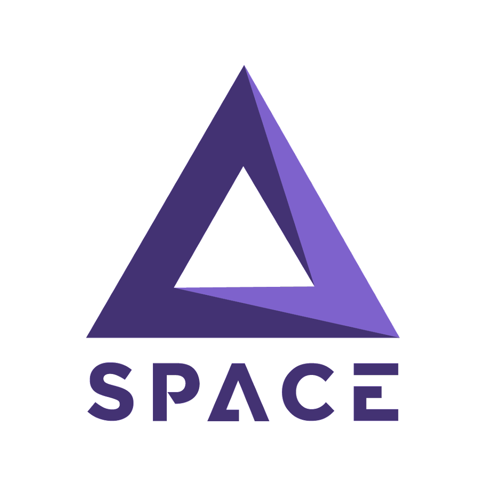
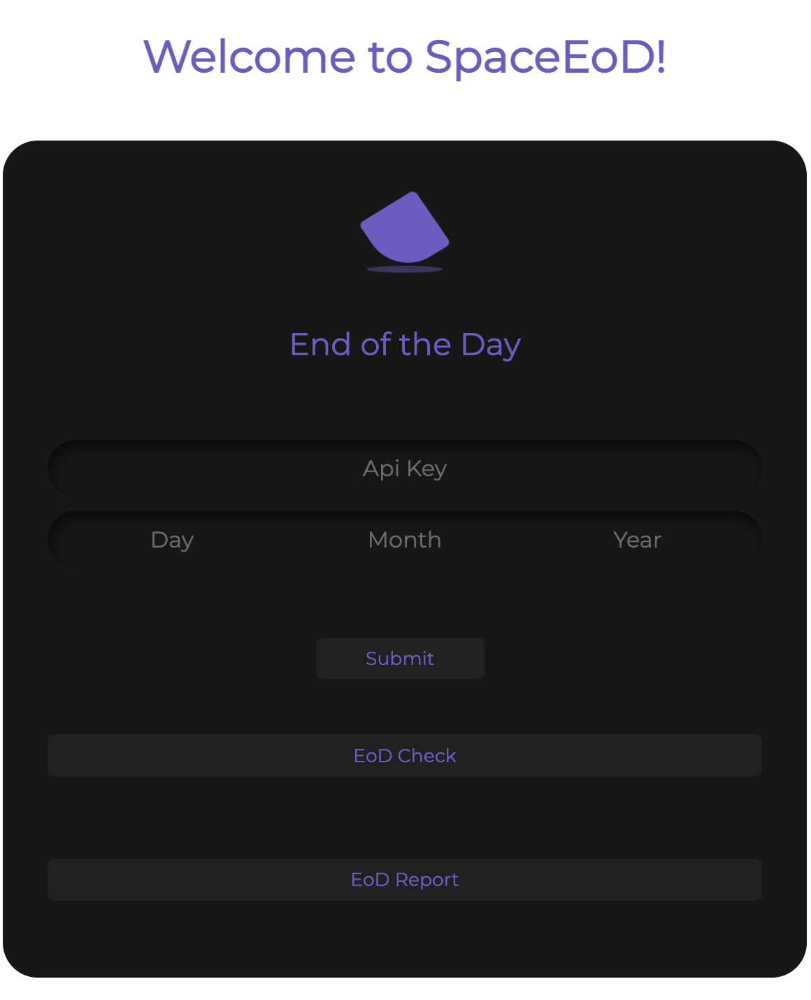

<div align="center">
 <h1>SpaceDev End of the Day Generator </h1>
</div>

<div align="center">
  
  <a href="https://github.com/MarSH-Up/SpaceDEV-EoD">
    
  </a>
  <a href="https://www.npmjs.com/">
    
  </a>
</div>


SpaceEoD generator is a [React](https://facebook.github.io/react/) app created to automatize the report we send at the end of the day, indicating the tasks we worked on during the day and the update. 

This app implemented the [ClickUp API](https://clickup.com/api/), the platform we use to follow up on tasks. However, if you are from SpaceDEV and are going to continue the project, please reach me, so I can give you access to modify this repository and internal documentation. 

## Docs & Resources

* [ClickUp API](https://clickup.com/api/)
* [Axios](https://axios-http.com/docs/intro)

## Running and building the app

```
#Install libraries
$ npm install axios axios-rate-limit axios-retry

# Development
$ npm run dev

# build producton
$ npm run build

```

## Requirements 

<div align='left'>
    <ul>
        <li>You may need to generate you API key from ClickUp</li>
        <li>Project is created for an specific space, you may need to change it to use another. <i>Check the helper: getTasks</i></li>
    </ul>
</div>

## To Do

<div align='left'>
    <ul>
        <li>Identify the user that updated the task.</li>
        <li>Better responsive design of the app.</li>
        <li>[Optional] Include a user login saving the API key on a database. (Note: This point is not necessary as you could easily save your API on the explorer).</li>
    </ul>
</div>

## Main Page

<div align='center'>
    
</div>

